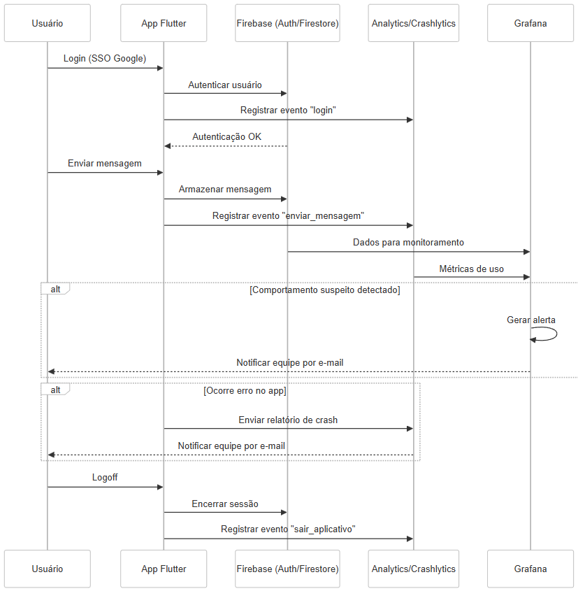

# 📱 ChatApp - Plano de Observabilidade

Este repositório contém o **plano de observabilidade** para um aplicativo de chat desenvolvido em **Flutter**, com **Firestore** como backend e autenticação via **Google SSO**. O foco é garantir **monitoramento eficaz**, **detecção de falhas** e **alertas inteligentes** para manter a qualidade da aplicação.

## 📌 Introdução

O aplicativo de chat foi projetado para oferecer comunicação ágil e segura. Com isso, o monitoramento de erros, eventos e atividades suspeitas é essencial. Este plano define a estratégia de observabilidade para garantir a estabilidade e confiabilidade do sistema.

---

## 📎 Links Importantes

- 📄 [Plano de Observabilidade (PDF)](docs/plano-observabilidade.pdf)
- 🎥 [Apresentação (Youtube)](https://youtu.be/mC0hsoYroJI)

---

## 🧭 Diagrama de Sequencia

---

## ✅ Requisitos

### Funcionais

- **Tela de Configurações**
    - Visualização do nome e email do usuário
    - Logoff
    - Ação manual para gerar um crash e testar o Crashlytics

- **Monitoramento de Erros e Crashes (Firebase Crashlytics)**
    - Registro de falhas com stack trace
    - Notificações automáticas por e-mail em caso de novos erros ou aumento na taxa de falhas

- **Eventos de Uso (Firebase Analytics)**  
  Eventos coletados:
    - `enviar_mensagem`
    - `login`
    - `login_falha`
    - `login_sucesso`
    - `sair_aplicativo`
    - `tentativa_login`
    - `testar_crashlytics`

- **Observabilidade do Firestore via Grafana**
    - Visualização centralizada dos dados de alerta

- **Alertas Automáticos**
    - 🚨 **Potencial Spam**: >100 mensagens em <1 minuto
    - 🚨 **Alto Volume**: >500 mensagens em <1 minuto
    - 🚨 **Palavrão Detectado**

### Não Funcionais

- Segurança e integridade dos dados
- Identificação rápida de comportamentos suspeitos
- Simplicidade na implementação das métricas e alertas

---

## 🎯 Escopo

### Dentro do Escopo

- Erros e Crashes com Firebase Crashlytics
- Eventos de uso com Firebase Analytics
- Dashboards e alertas no Grafana com foco em:
    - Spam
    - Volume de mensagens
    - Palavrões
    - Usuários inativos (indicador informativo)

### Fora do Escopo

- Monitoramento avançado de performance
- Backend próprio (utiliza Firebase)

---

## 🎯 Objetivos de Observabilidade

- Detecção e correção imediata de erros
- Entendimento do comportamento dos usuários
- Identificação de comportamentos anômalos
- Acompanhamento contínuo dos alertas

---

## 🧠 Estratégia de Monitoramento

| Componente         | Descrição |
|--------------------|-----------|
| Firebase Crashlytics | Captura de falhas e acionamento manual de crash |
| Firebase Analytics  | Coleta de eventos de uso |
| Firestore + Grafana | Dashboards centralizados com dados de alerta |
| Indicadores        | Usuários inativos, sem alertas automáticos |

---

## 🛠️ Ferramentas Utilizadas

- **Firebase Crashlytics**: Monitoramento de erros e crashes
- **Firebase Analytics**: Coleta de eventos de uso
- **Firestore**: Armazenamento de dados com foco em alertas
- **Grafana**: Visualização e dashboards

---

## 📊 Métricas e Indicadores-Chave

- **🚨 Potencial Spam**: >100 mensagens por usuário em <1 minuto
- **🚨 Alto Volume**: >500 mensagens totais em <1 minuto
- **🚨 Palavrão Detectado**
- **👤 Usuários Inativos**: Indicador para ausência de acesso

---

## 📈 Dashboards e Relatórios

### Grafana

Visualizações de:
- Potenciais spams e alto volume de mensagens
- Ocorrência de palavrões
- Indicador de inatividade de usuários

### Firebase Consoles

- Crashlytics: Erros e crashes
- Analytics: Eventos e fluxos de uso

---

## 🔔 Alertas e Notificações

- **Crashlytics**: Envio automático de e-mails para a equipe
- **Grafana**:
    - Potencial Spam
    - Alto Volume de Mensagens
    - Palavrão Detectado

> ⚠️ Os alertas são redirecionados para os e-mails atuais da equipe.

---

## ✅ Conclusão

A estratégia de observabilidade proposta oferece uma visão completa sobre erros, uso e comportamentos suspeitos no aplicativo. Com a integração entre **Firebase** e **Grafana**, a equipe consegue atuar proativamente, garantindo uma experiência estável e segura aos usuários.

---

> Desenvolvido como parte de um projeto acadêmico para estudo e prática de observabilidade em aplicações mobile modernas.

